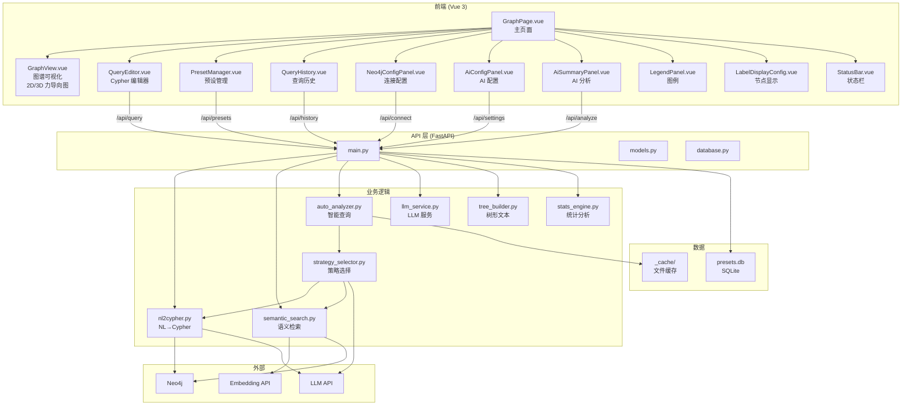
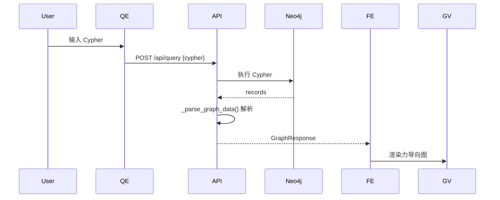
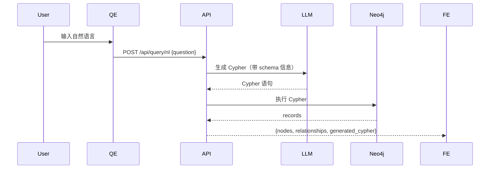
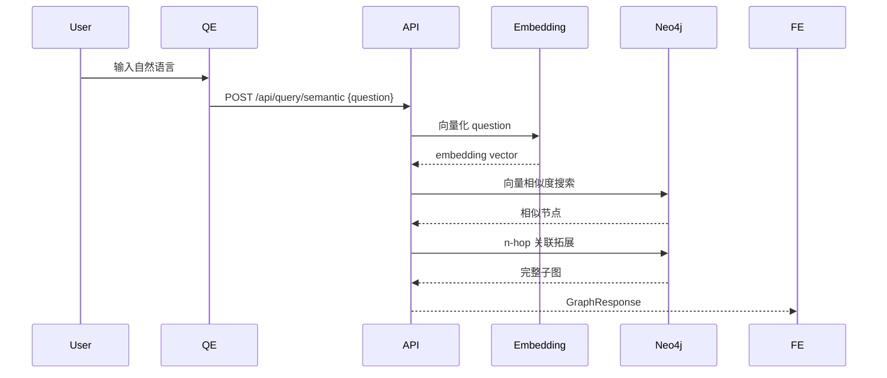
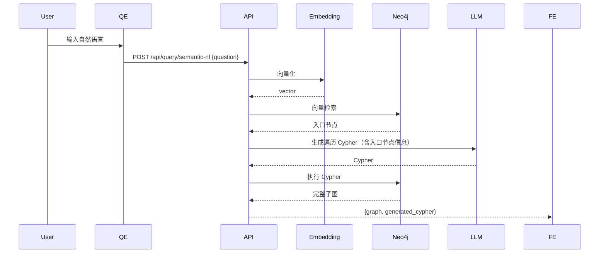
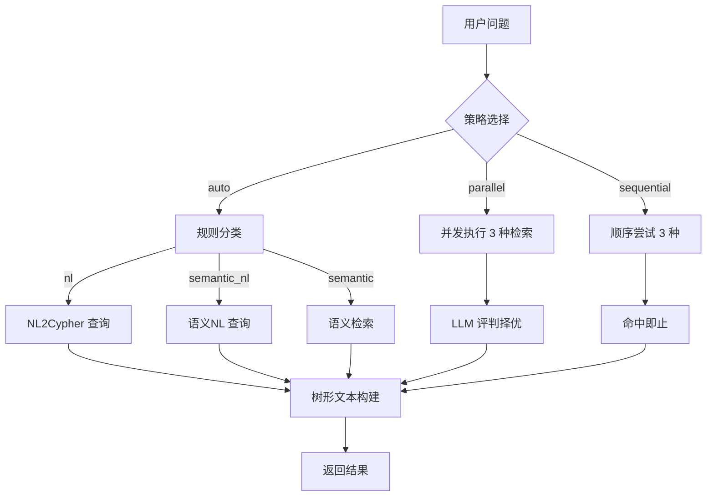

# GraphVI 系统架构与接口文档

> 版本：1.0.0 | 更新日期：2026-07-30

---

## 一、系统架构总览

### 技术栈

| 层级 | 技术 | 说明 |
|---|---|---|
| **前端** | Vue 3 + Vite 6 + Element Plus | SPA 单页应用，力导向图谱可视化 |
| **后端** | Python 3.12 + FastAPI | RESTful API，异步非阻塞 |
| **图数据库** | Neo4j 5.x | 知识图谱存储，向量索引 |
| **AI 模型** | OpenAI API / Azure OpenAI | LLM (Cypher生成/分析) + Embedding (语义检索) |
| **本地存储** | SQLite | 配置、预设、查询历史 |

### 分层架构



---

## 二、核心数据模型

### 2.1 后端 Pydantic 模型 (`backend/models.py`)

```text
GraphResponse           图谱响应数据
 ├── nodes: list[NodeDTO]          节点列表
 └── relationships: list[RelationshipDTO]  关系列表

NodeDTO                 图节点
 ├── id: str            elementId
 ├── labels: list[str]  标签（如 ["dm_event_info"]）
 ├── properties: dict   属性键值对
 └── caption: str       显示标题

RelationshipDTO         图关系
 ├── id: str            elementId
 ├── type: str          关系类型（如 PARENT_OF）
 ├── source: str        起点节点 ID
 ├── target: str        终点节点 ID
 └── properties: dict   关系属性

AutoAnalyzeRequest      智能查询请求
 ├── question: str                 自然语言问题
 ├── strategy: str = "auto"        策略: auto/parallel/sequential
 ├── top_k: int | None             语义检索 topK
 ├── score_threshold: float | None 分数阈值
 ├── stream: bool = false          是否 SSE 流式
 └── summary_prompt: str | None    自定义 prompt
```

### 2.2 后端核心类（Python）

#### Neo4jConnectionManager (`backend/database.py`)

连接管理器，全局单例。按 `(uri, username, password)` 缓存 driver 实例。

```python
class Neo4jConnectionManager:
    """Neo4j 连接池管理器，支持动态配置切换。"""

    _driver: AsyncDriver | None  # 缓存的 Neo4j 异步驱动

    # ── 生命周期 ──────────────────────────────────
    async def get_connection(self) -> AsyncDriver
        """获取/创建 Neo4j 驱动（延迟初始化，按配置缓存）。"""
        # 连接池: max_connection_lifetime=3600, max_pool_size=10

    async def reconnect(self)
        """关闭旧连接，用当前配置重建驱动。"""

    async def close_all(self)
        """关闭所有连接（应用退出时调用）。"""

    # ── 查询执行 ──────────────────────────────────
    async def run_query(self, cypher: str, parameters: dict | None = None)
        -> tuple[list[Record], ResultSummary]
        """执行 Cypher，返回保留 Neo4j 类型的 records。"""
        # 使用 async for record in result（不用 result.data()）
        # 以保留 Node/Relationship/PATH 等类型信息供 _parse_graph_data 解析
```

#### LLM 服务 (`backend/llm_service.py`)

```python
# ── 核心函数 ─────────────────────────────────────
async def _call_llm_async(prompt: str, temperature=0.1, max_tokens=8192) -> str
    """异步调用 LLM API，走 _get_llm_client() 缓存连接池。"""
    # 配置来源: llm_endpoint / llm_api_key / llm_model（默认 gpt-4o）

def _call_llm_sync(prompt: str, temperature=0.1, max_tokens=8192) -> str
    """同步调用 LLM API，无连接池复用。"""

async def test_llm_connection(config_override: dict | None = None) -> str
    """测试 LLM 连接，支持临时配置覆盖。"""

async def call_llm_stream(nodes, relationships, custom_prompt=None) -> AsyncGenerator[str]
    """流式 AI 分析（SSE），逐 token 返回。"""

# ── 连接池 ───────────────────────────────────────
_llm_client: httpx.AsyncClient | None   # 全局缓存的 client
_llm_client_key: str                    # 缓存 key: "{endpoint}|{api_key[:8]}"

def _get_llm_client(endpoint: str, api_key: str) -> httpx.AsyncClient
    """获取/创建缓存的 AsyncClient。配置不变则复用同一连接池。"""

def invalidate_llm_client()
    """配置变更时清除缓存，下次调用重建。"""

# ── 统计脚本 ─────────────────────────────────────
def _aggregate_stats(nodes, relationships, ignored_label="") -> dict
    """预聚合图数据统计（数值字段求和/平均等）。"""

def _safe_exec(script: str, nodes, relationships) -> dict
    """安全执行 LLM 生成的 Python 统计脚本（LangChain PythonREPL）。"""
```

#### 语义检索 (`backend/semantic_search.py`)

```python
# ── 公开接口（供 main.py 调用） ─────────────────────
async def semantic_search(question: str, top_k: int | None = None) -> GraphResponse
    """向量检索 → 分数过滤 → n-hop 关联拓展。"""
    # 1. VectorRetriever 获取候选节点
    # 2. 按 score_threshold 过滤（默认 0.6）
    # 3. Cypher 遍历关联（hops 可配置，默认 1）
    # 4. _parse_records() 解析为 GraphResponse

async def semantic_nl_search(question: str, top_k: int | None = None)
    -> tuple[GraphResponse, str]
    """向量检索 → LLM 生成遍历 Cypher → 执行并返回结果。"""
    # 1. VectorRetriever 获取入口节点
    # 2. 构建 prompt 含 schema + 入口节点信息
    # 3. LLM 生成遍历 Cypher
    # 4. 执行 Cypher 返回完整子图

# ── Embedding 连接池 ─────────────────────────────
_embed_client: httpx.Client | None      # 全局缓存的 embedding client
_embed_client_key: str                  # 缓存 key

def _get_embed_client(endpoint: str, api_key: str) -> httpx.Client
    """获取/创建缓存的 httpx.Client 用于 Embedding API 调用。"""

def _invalidate_embed_client()
    """配置变更时清除缓存。"""

class _HttpxEmbedder:
    """自定义 Embedder，使用 httpx 直接调用 Embedding API。"""
    def embed_query(self, text: str) -> list[float]
        # 调用 POST {endpoint}/embeddings，返回向量

# ── 内部解析 ─────────────────────────────────────
def _parse_records(records) -> GraphResponse
    """从 Neo4j records 解析出节点和关系（同 main._parse_graph_data）。"""
```

#### NL2Cypher (`backend/nl2cypher.py`)

```python
# ── 公开接口 ─────────────────────────────────────
async def nl2cypher(question: str) -> dict
    """自然语言 → Cypher → 执行 → 返回 {records, generated_cypher}。"""
    # 1. Text2CypherRetriever 生成 Cypher
    # 2. _fix_unnamed_rels() 修复未命名关系
    # 3. 通过 conn_manager.run_query() 执行
    # 4. Cypher 后处理: 修复 STARTS WITH 误匹配等

async def generate_cypher_only(question: str) -> str
    """只生成 Cypher 不执行，供预览使用。"""

# ── Schema 缓存 ─────────────────────────────────
_schema_cache: str | None               # 带示例的 schema（用于 NL）
_schema_cache_ns: str | None            # 不带示例的 schema（用于语义NL）

def _get_schema(driver, db, include_samples=True) -> str
    """获取 Neo4j schema 描述文本（节点标签/属性/关系类型）。"""

def invalidate_schema_cache()
    """schema_include 配置变更时清除缓存。"""

def _fix_unnamed_rels(cypher: str) -> str
    """修复未命名关系（neo4j-graphrag 已知 bug）。"""
```

#### 智能查询分析 (`backend/auto_analyzer.py`)

```python
# ── 入口（供 main.py 调用） ──────────────────────
async def auto_analyze(question, strategy="auto", ...)
    -> dict | AsyncGenerator[dict]
    """统一入口，按 stream 参数分派到流式或非流式模式。"""

async def auto_analyze_nonstream(question, ...) -> dict
    """非流式：收集全部事件 → 组装 {result, strategy_used}。"""

async def auto_analyze_stream(question, ...) -> AsyncGenerator[dict]
    """SSE 流式：逐事件 yield，支持前端实时展示进度。"""

# ── 内部管道 ─────────────────────────────────────
async def _pipeline(question, strategy, top_k, ...) -> AsyncGenerator[dict]
    """执行管道: 策略选择 → 检索 → 树形文本构建。"""
    # Phase 1: 策略选择（auto/parallel/sequential）
    # Phase 2: 执行检索，获取 GraphResponse
    # Phase 3: 树形文本格式化（build_tree_text）
    # 每阶段通过 yield 事件通知调用方

async def _single_retrieve(question, method, top_k, ...) -> tuple[GraphResponse, str]
    """按 method 执行单种检索（nl/semantic/semantic_nl）。"""
```

#### 查询策略选择 (`backend/strategy_selector.py`)

```python
def llm_classify(question: str) -> str
    """规则分类：含命名实体关键词 → semantic_nl，否则 → nl。"""

async def parallel_trial(question, top_k, score_threshold)
    -> tuple[str, GraphResponse, str | None]
    """并发 3 种检索 → 过滤空结果 → LLM 评判最优。"""

async def sequential_trial(question, top_k, score_threshold)
    -> tuple[str, GraphResponse, str | None]
    """顺序尝试 nl → semantic_nl → semantic，命中即止。"""
```

#### 树形文本构建 (`backend/tree_builder.py`)

```python
def build_tree_text(graph_data: GraphResponse, ignored_label: str = "") -> str
    """将图数据转为缩进树形文本，用于自动查询的结果展示。"""
    # 1. 计算入口节点（有出度无入度的节点 + 孤立节点）
    # 2. DFS 遍历，每层缩进 2 空格
    # 3. 节点格式: _node_summary() 使用 node_templates.json 模板
    # 4. 关系格式: _rel_name() 使用 rel_names 映射为中文名

def _node_summary(node, ignored_label="") -> str
    """格式化节点: 按模板替换 {label} {属性名}。"""

def _rel_name(rel_type: str) -> str
    """关系类型映射为中文名，如 PARENT_OF → 父事件。"""
```

### 2.3 前端关键类（Vue 组件）

#### GraphPage.vue（主页面，状态容器）

```typescript
// 持有的全局状态
interface GraphPageState {
    graphData: { nodes: NodeDTO[], relationships: RelationshipDTO[] } | null
    loading: boolean
    status: string
    config: Neo4jConfig          // uri, username, password, database
    aiConfig: AiConfig           // llm_endpoint, api_key, model, embedding...
    labelProps: Record<string, string>  // 节点类型 → 显示属性映射
    isDark: boolean              // 暗色/亮色主题
}
```

#### GraphView.vue（图谱画布，核心可视化组件）

```typescript
// 2D 渲染（force-graph）
interface GraphView2D {
    graphInstance: ForceGraphInstance    // force-graph 实例
    hoveredNode: NodeDTO | null         // 当前悬停节点
    highlightNodes: Set<string>         // 高亮节点 ID 集合
    nodeCanvasObject(ctx, node)         // 每帧重绘回调（自定义节点渲染）

    // 方法
    focusNode(nodeId: string)           // 聚焦到节点（centerAt + zoom）
    zoomToFit()                         // 自动适配画布
    buildFreshData()                    // 创建新对象防止 d3 mutation
}

// 3D 渲染（3d-force-graph）
interface GraphView3D {
    graphInstance: ForceGraph3DInstance // 3d-force-graph 实例
    nodeObjects3D: Map<string, Object3D> // 所有 Three.js 节点对象
    bloomPass: UnrealBloomPass          // 辉光后期效果

    refresh3DHighlights()               // 动态更新材质和光环
}

// 属性面板（tooltip）
interface NodeTooltip {
    node: NodeDTO | null
    visible: boolean
    position: { x: number, y: number }
    renderProperty(value: string): string  // 智能渲染：图片→，视频→<video>
}
```

#### PresetManager.vue（查询预设管理）

```typescript
interface Preset {
    id: number
    question: string           // 自然语言问题
    cypher: string | null      // 对应的 Cypher
    created_at: string
    updated_at: string
}
```

#### Neo4jConfigPanel.vue（连接配置）

```typescript
interface Neo4jConfig {
    uri: string        // bolt://localhost:7687
    username: string   // neo4j
    password: string
    database: string   // kmdevelop
}
```

#### AiConfigPanel.vue（AI 模型配置）

```typescript
interface AiConfig {
    llm_endpoint: string        // https://api.openai.com/v1
    llm_api_key: string
    llm_model: string           // gpt-4o
    embedding_endpoint: string
    embedding_api_key: string
    embedding_model: string     // text-embedding-3-small
}
```

### 2.4 前端组件状态（GraphPage.vue）

| 状态字段 | 类型 | 说明 |
|---|---|---|
| `graphData` | `{nodes, relationships}` | 当前渲染的图谱数据 |
| `loading` | boolean | 查询加载中 |
| `status` | string | 状态提示信息 |
| `config` | object | Neo4j 连接信息 |
| `aiConfig` | object | AI 模型配置 |
| `labelProps` | object | 节点属性显示配置 |
| `isDark` | boolean | 暗色/亮色主题 |

---

## 三、数据库设计

### 3.1 SQLite 本地存储

配置文件路径通过环境变量 `GRAPHVI_DB_PATH` 指定，默认 `backend/presets.db`。

#### 表：presets（查询预设）

```sql
CREATE TABLE presets (
    id          INTEGER PRIMARY KEY AUTOINCREMENT,
    question    TEXT NOT NULL,          -- 自然语言问题
    cypher      TEXT,                   -- 对应的 Cypher
    created_at  TEXT DEFAULT (datetime('now')),
    updated_at  TEXT DEFAULT (datetime('now'))
);
```

#### 表：settings（系统设置）

```sql
CREATE TABLE settings (
    key   TEXT PRIMARY KEY,
    value TEXT NOT NULL
);
```

| 配置键 | 默认值 | 说明 |
|---|---|---|
| `llm_endpoint` | `https://api.openai.com/v1` | LLM API 地址 |
| `llm_api_key` | (空) | LLM API Key |
| `llm_model` | `gpt-4o` | LLM 模型 |
| `embedding_endpoint` | `https://api.openai.com/v1` | Embedding API 地址 |
| `embedding_api_key` | (空) | Embedding API Key |
| `embedding_model` | `text-embedding-3-small` | Embedding 模型 |
| `vector_index_name` | `entity_vector` | Neo4j 向量索引名 |
| `semantic_top_k` | `10` | 语义检索返回条数 |
| `semantic_score_threshold` | `0.6` | 语义检索分数阈值 |
| `semantic_query_hops` | `1` | 关联拓展跳数 |
| `neo4j_uri` | `bolt://localhost:7687` | Neo4j 地址 |
| `neo4j_username` | `neo4j` | Neo4j 用户名 |
| `neo4j_password` | `adminadmin` | Neo4j 密码 |
| `neo4j_database` | `kmdevelop` | Neo4j 数据库 |
| `ignored_label` | `_Embeddable` | 忽略的节点标签 |
| `cache_ttl` | `300` | 自动查询缓存秒数 |

#### 表：query_history（查询历史）

```sql
CREATE TABLE query_history (
    id          INTEGER PRIMARY KEY AUTOINCREMENT,
    question    TEXT,
    cypher      TEXT NOT NULL,
    type        TEXT NOT NULL,          -- nl/semantic/semantic_nl/manual
    db_uri      TEXT NOT NULL,
    db_name     TEXT NOT NULL,
    created_at  TEXT DEFAULT (datetime('now'))
);
```

---

## 四、查询流程详解

### 4.1 直接 Cypher 查询



### 4.2 自然语言→Cypher (NL2Cypher)



### 4.3 语义检索



### 4.4 语义NL（向量检索 + LLM 遍历）



### 4.5 智能查询分析



---

## 五、关键 API 接口

### 5.1 健康检查

```
GET /api/health
```

```bash
curl http://localhost:8000/api/health
# → {"status":"ok"}
```

### 5.2 执行 Cypher

```
POST /api/query
Content-Type: application/json
```

```bash
curl -X POST http://localhost:8000/api/query \
  -H "Content-Type: application/json" \
  -d '{"cypher": "MATCH (n) RETURN n LIMIT 5"}'
```

**响应**：
```json
{
  "nodes": [
    {
      "id": "4:51a4facb-...:9108319",
      "labels": ["dm_event_info"],
      "properties": {
        "name": "XX事件",
        "编码": "SJ-2026-01-07-xxx",
        "类型": "暴雨",
        "级别": "市级",
        "状态": "响应中",
        "时间": "2026-07-01 09:00:00"
      },
      "caption": "XX事件"
    }
  ],
  "relationships": [
    {
      "id": "5:51a4facb-...:12345",
      "type": "PARENT_OF",
      "source": "4:51a4facb-...:9108319",
      "target": "4:51a4facb-...:9108483",
      "properties": {}
    }
  ]
}
```

### 5.3 自然语言查询

```
POST /api/query/nl
Content-Type: application/json
```

```bash
curl -X POST http://localhost:8000/api/query/nl \
  -H "Content-Type: application/json" \
  -d '{"question": "查询所有台风相关事件"}'
```

**响应**：
```json
{
  "nodes": [...],
  "relationships": [...],
  "generated_cypher": "MATCH (n:dm_event_info) WHERE n.类型 CONTAINS '台风' RETURN n LIMIT 100"
}
```

### 5.4 语义检索

```
POST /api/query/semantic
Content-Type: application/json
```

```bash
curl -X POST http://localhost:8000/api/query/semantic \
  -H "Content-Type: application/json" \
  -d '{"question": "巴威台风应急通信保障", "top_k": 5}'
```

**响应**：`GraphResponse` 结构

### 5.5 语义NL（向量+LLM遍历）

```
POST /api/query/semantic-nl
Content-Type: application/json
```

```bash
curl -X POST http://localhost:8000/api/query/semantic-nl \
  -H "Content-Type: application/json" \
  -d '{"question": "巴威台风调用了哪些车辆、人员", "top_k": 5}'
```

**响应**：
```json
{
  "nodes": [...],
  "relationships": [...],
  "generated_cypher": "MATCH (entry) WHERE elementId(entry) IN [...]\nOPTIONAL MATCH ..."
}
```

### 5.6 智能查询分析

```
POST /api/query/auto
Content-Type: application/json
```

```bash
# 非流式
curl -X POST http://localhost:8000/api/query/auto \
  -H "Content-Type: application/json" \
  -d '{"question": "查询近一个月广西的事件", "strategy": "auto", "stream": false}'
```

**非流式响应**：
```json
{
  "result": "[dm_event_info] 事件「XXX」...\n\n[dm_event_info] 事件「YYY」...",
  "strategy_used": "nl"
}
```

```bash
# 流式（SSE）
curl -N -X POST http://localhost:8000/api/query/auto \
  -H "Content-Type: application/json" \
  -d '{"question": "查询近一个月广西的事件", "strategy": "auto", "stream": true}'
```

**流式响应**：
```
event: strategy_start
data: {"message": "正在分析查询策略..."}

event: strategy
data: {"strategy": "nl"}

event: retrieve_start
data: {"message": "正在查询数据（策略：nl）..."}

event: retrieve
data: {"method": "nl", "nodes": 24, "relationships": 0}

event: text
data: "[dm_event_info] 事件「XXX」..."
```

### 5.7 查询预设

```
GET  /api/presets              → list[PresetResponse]
POST /api/presets              → PresetResponse (201)
PUT  /api/presets/{id}         → PresetResponse
DELETE /api/presets/{id}       → 204
```

```bash
curl http://localhost:8000/api/presets
# → [{"id":1,"question":"查询50条数据","cypher":"MATCH ...","created_at":"...","updated_at":"..."}]
```

### 5.8 Neo4j 连接配置

```
POST /api/connect
Content-Type: application/json
```

```bash
curl -X POST http://localhost:8000/api/connect \
  -H "Content-Type: application/json" \
  -d '{
    "uri": "bolt://localhost:7687",
    "username": "neo4j",
    "password": "xxx",
    "database": "kmdevelop",
    "save": true
  }'
```

**响应**：
```json
{"status": "connected", "message": "Neo4j 连接成功"}
```

### 5.9 系统设置

```
GET  /api/settings     → 全部设置键值对
PUT  /api/settings     → {"status":"ok"}
```

```bash
curl -X PUT http://localhost:8000/api/settings \
  -H "Content-Type: application/json" \
  -d '{"settings": {"llm_model": "gpt-4o-mini"}}'
```

### 5.10 查询历史

```
GET   /api/history?limit=50     → 历史列表
POST  /api/history              → {"status":"ok"}
DELETE /api/history/{id}        → {"status":"ok"}
DELETE /api/history             → {"status":"ok"}
```

### 5.11 AI 分析总结

```
POST /api/analyze/test          → {"status":"ok","reply":"..."}
POST /api/analyze/stream        → SSE 流式 AI 分析
```

---

## 六、部署

### Docker 构建

```bash
# 构建前端
cd frontend && npx vite build

# 构建镜像
docker build -f deploy/Dockerfile -t graphvi:latest .

# 导出离线包
docker save -o graphvi-image.tar graphvi:latest

# 运行容器
docker run -d \
  --name graphvi \
  --restart unless-stopped \
  -p 8000:8000 \
  -e GRAPHVI_DB_PATH=/data/presets.db \
  -v /path/to/deploy/data:/data \
  graphvi:latest
```

详见 [BUILD.md](../deploy/BUILD.md)
